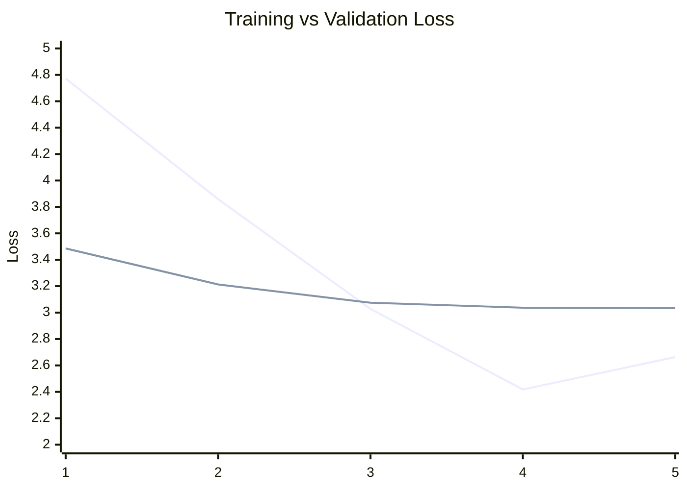

# 🕵️‍♂️ Sherlock AI - Kerala Crime Detective

Sherlock AI is an advanced, AI-powered crime investigation assistant designed to analyze evidence, detect criminal patterns, and provide investigative insights. This repository contains the full-stack infrastructure including a React Native mobile application, a FastAPI backend, and a fine-tuned Large Language Model (LLM) specialized in crime detection.

## 🧠 Model Specifications: Kerala Crime Detective

The core of Sherlock AI is a fine-tuned **Gemma-based** model specifically trained on criminal investigation datasets to improve reasoning and domain-specific knowledge.

> [!NOTE]
> **Hugging Face Model Hub**: [hf.co/wincode/kerala-crime-detective-gemma](https://huggingface.co/wincode/kerala-crime-detective-gemma)

### 📊 Model Metrics
- **Total Parameters**: 999,885,952 (~1B)
- **Trainable Parameters**: 999,885,952
- **Model Size (FP16)**: 3,814.26 MB
- **Architecture**: Optimized Gemma-3 Fine-tune

### 📈 Training Progress
The model was trained for 5 epochs with significant convergence in validation loss.

| Epoch | Training Loss | Validation Loss |
|-------|---------------|-----------------|
| 1     | 4.7725        | 3.4864          |
| 2     | 3.8592        | 3.2127          |
| 3     | 3.0276        | 3.0749          |
| 4     | 2.4176        | 3.0372          |
| 5     | 2.6630        | 3.0344          |

#### Loss Curve (Visualization)

*(Blue: Training Loss, Orange: Validation Loss)*

---

## 📱 Mobile Application (Expo)
A cross-platform React Native app featuring:
- **Voice Intelligence**: Real-time voice-to-voice interaction using ElevenLabs and Whisper.
- **Evidence Analysis**: Chat interface with markdown support for investigative reports.
- **Secure Auth**: Google OAuth integration and JWT-based session management.

## ⚙️ Backend Infrastructure (FastAPI)
- **AI Service**: High-speed inference using Hugging Face TGI and Ollama.
- **Database**: MongoDB for persistent conversation storage and evidence tracking.
- **Voice Pipeline**: Integrated Whisper (STT) and ElevenLabs (TTS).

---

## 🚀 Getting Started

### 1. Backend Setup
```bash
cd backend
pip install -r requirements.txt
python main.py
```

### 2. Mobile Setup
```bash
cd mobile
npm install
npx expo start
```

## 📜 License
Privately developed by Ahmad Shajhan (wincode).
